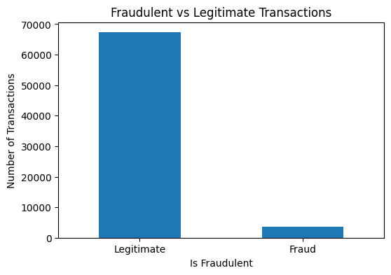
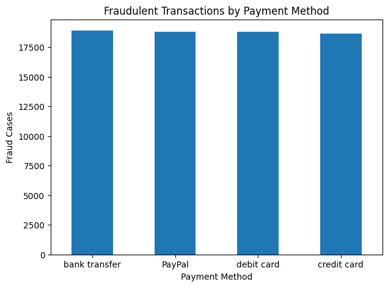
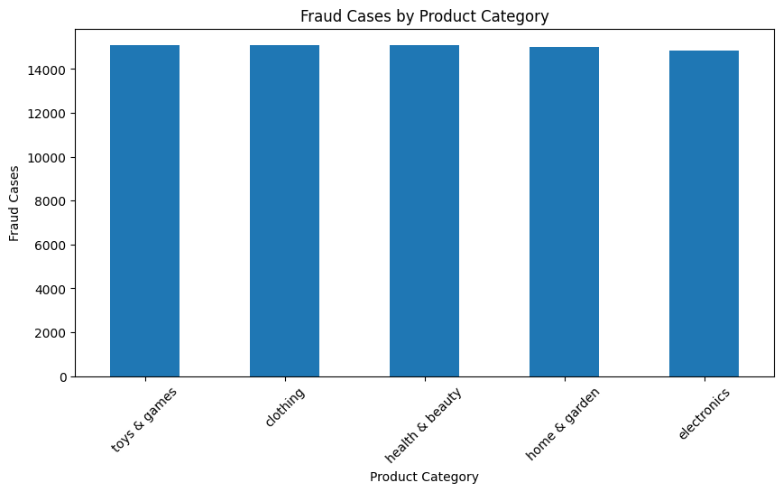
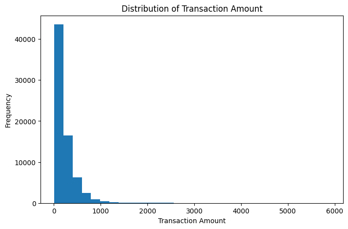

# 🛡️ E-Commerce Fraud Detection Analysis


An end-to-end **Data Analytics** project focused on detecting fraud patterns in e-commerce transactions using **Python, SQL (SQLite), and Power BI**.

This project demonstrates the complete analytics workflow—from data cleaning and exploratory data analysis (EDA) to SQL-based business analysis and interactive dashboard development.

---

# 📌 Project Overview

Online fraud is one of the biggest challenges faced by e-commerce businesses, resulting in significant financial losses and customer trust issues.

The objective of this project is to analyze transaction data, identify fraud patterns, understand customer behavior, and generate business insights that can help reduce fraudulent transactions.

This project is designed as a professional portfolio project for **Data Analyst**, **Business Intelligence Analyst**, and **Marketing Data Analyst** roles.

---

# 🎯 Project Objectives

- Analyze e-commerce transaction data
- Clean and preprocess raw datasets
- Perform Exploratory Data Analysis (EDA)
- Identify fraud trends and risk factors
- Generate business insights using SQL
- Build an interactive Power BI dashboard
- Demonstrate an end-to-end analytics workflow

---

# 🛠️ Tech Stack

- Python
- Pandas
- NumPy
- Matplotlib
- Google Colab
- SQLite
- SQL
- Power BI *(In Progress)*
- Git
- GitHub

---

# 📊 Dataset Summary

| Metric | Value |
|----------|--------|
| Dataset | E-Commerce Fraud Detection Dataset |
| Records | 70,766 |
| Features | 16 |
| Missing Values | Removed |
| Duplicate Records | Removed |
| Fraud Rate | ~5% |

---

# 📂 Project Structure

```
ecommerce-fraud-detection-analysis/

│
├── data/
│   ├── Fraudulent_E-Commerce_Transaction_Data.csv
│   └── Fraud_Final.csv
│
├── notebooks/
│   └── Ecommerce_Fraud_Detection_Project.ipynb
│
├── images/
│   ├── fraud_bar_chart.png
│   ├── fraud_pie_chart.png
│   ├── transaction_amount_histogram.png
│   ├── payment_method_distribution.png
│   ├── fraud_by_payment_method.png
│   ├── product_category_distribution.png
│   ├── fraud_product_category.png
│   ├── customer_age_distribution.png
│   ├── fraud_by_age_group.png
│   └── transaction_amount_boxplot.png
|
├── docs/
│
├── sql/
|
├── powerbi/
│
├── README.md
│
└── requirements.txt
```

---

# 🔄 Project Workflow

```
Raw Dataset (CSV)
        │
        ▼
Data Cleaning (Python)
        │
        ▼
Exploratory Data Analysis
        │
        ▼
Business Insights
        │
        ▼
SQL Analysis (SQLite)
        │
        ▼
Power BI Dashboard
        │
        ▼
Final Project Documentation
```

---

# 📊 Dataset Features

- Transaction ID
- Customer ID
- Transaction Amount
- Transaction Date
- Payment Method
- Product Category
- Quantity
- Customer Age
- Customer Location
- Device Used
- IP Address
- Shipping Address
- Billing Address
- Is Fraudulent
- Account Age Days
- Transaction Hour

---

# ✅ Work Completed

## Phase 1 – Project Setup

Completed

- Repository created
- Project folder structure created
- Dataset uploaded
- Google Colab notebook created
- GitHub Project Board created

---

## Phase 2 – Data Loading

Completed

- Imported required Python libraries
- Loaded dataset
- Checked dataset shape
- Examined column names
- Verified data types
- Generated descriptive statistics

---

## Phase 3 – Data Cleaning

Completed

- Checked missing values
- Removed missing records
- Removed duplicate records
- Converted Transaction Date into datetime format
- Verified data types
- Exported cleaned dataset (Fraud_Final.csv)

---

## Phase 4 – Exploratory Data Analysis (EDA)

Completed

### Fraud Analysis

- Fraud vs Legitimate Transactions
- Fraud Percentage

### Transaction Analysis

- Transaction Amount Distribution
- Histogram
- Summary Statistics

### Payment Method Analysis

- Transaction Distribution
- Fraud Count
- Fraud Rate

### Product Category Analysis

- Transaction Distribution
- Fraud Distribution
- Fraud Rate

### Customer Analysis

- Customer Age Distribution
- Fraud by Age Group

### Device Analysis

- Device Distribution
- Fraud Rate by Device

### Outlier Detection

- Box Plot
- IQR Method
- High-value Transaction Detection

---

# 📈 Key Business Insights

- Fraud accounts for approximately **5%** of all transactions.
- Credit Card transactions have the highest fraud rate.
- Mobile devices experience slightly higher fraud than Desktop and Tablet devices.
- Toys & Games has the highest fraud rate among product categories.
- Most purchases are low-value transactions with a small number of high-value outliers.
- Customer age distribution is balanced with no significant anomalies.
- Payment methods are evenly distributed across the dataset.

---

# 📊 Business KPIs

- Total Transactions
- Total Fraud Transactions
- Fraud Rate
- Average Transaction Amount
- Average Fraud Transaction Amount
- Fraud Rate by Payment Method
- Fraud Rate by Product Category
- Fraud Rate by Device
- High-Risk Customer Segments

---

# 📷 Visualizations Created

- Fraud Distribution Bar Chart
- Fraud Distribution Pie Chart
- Transaction Amount Histogram
- Payment Method Distribution
- Fraud by Payment Method
- Product Category Distribution
- Fraud by Product Category
- Customer Age Distribution
- Fraud by Age Group
- Transaction Amount Box Plot

---

# 🖼️ Visualization Preview

## Fraud Distribution



## Payment Method Analysis



## Product Category Analysis



## Transaction Amount Distribution



---

# 💾 SQL Analysis (SQLite)

## Objective

Perform SQL-based exploratory data analysis and business intelligence reporting using the cleaned fraud dataset.

### Tools Used

- SQLite
- SQLiteStudio
- SQL
- Fraud_Final.csv

### SQL Topics Covered

- SELECT
- WHERE
- ORDER BY
- GROUP BY
- Aggregate Functions
- CASE Statements
- Common Table Expressions (CTEs)
- Window Functions
- Ranking Functions
- Business KPI Queries

---

# 📊 Power BI Dashboard *(Upcoming)*

The dashboard will include:

- Executive Dashboard
- Fraud Overview
- Payment Analysis
- Product Analysis
- Customer Analysis
- Device Analysis
- Risk Analysis
- KPI Cards
- Interactive Filters

---

# 💡 Business Recommendations

Based on the analysis, the following recommendations can help reduce fraudulent transactions:

- Monitor high-value transactions using dynamic risk thresholds.
- Increase verification for transactions originating from new customer accounts.
- Implement device fingerprinting for suspicious devices.
- Flag unusual geographic locations for manual review.
- Strengthen fraud monitoring during peak fraud hours.
- Develop a real-time fraud monitoring dashboard.
- Retrain fraud detection models periodically using recent transaction data.

---

# 🚀 Getting Started

## Clone the Repository

```bash
git clone https://github.com/arvinpatel-ds/ecommerce-fraud-detection-analysis.git
```

## Navigate to Project Folder

```bash
cd ecommerce-fraud-detection-analysis
```

## Install Dependencies

```bash
pip install -r requirements.txt
```

## Launch Jupyter Notebook

```bash
jupyter notebook
```

---

# 📦 Requirements

```
Python 3.11+

pandas

numpy

matplotlib

jupyter

sqlite3

powerbi
```

---

# 🎯 Skills Demonstrated

- Data Cleaning
- Exploratory Data Analysis (EDA)
- Data Visualization
- SQL
- SQLite
- Business Intelligence
- KPI Development
- Feature Engineering
- Outlier Detection
- Business Insight Generation
- Python Programming
- Git & GitHub

---

# 🌟 Repository Highlights

- End-to-End Data Analytics Project
- Real-World Fraud Detection Dataset
- Python Data Analysis
- SQL Business Analysis
- Power BI Dashboard
- Business-Oriented Insights
- Recruiter-Friendly Documentation
- Clean Folder Structure
- Portfolio Ready

---

# 📚 Learning Outcomes

Throughout this project, I strengthened my skills in:

- Data Cleaning
- Exploratory Data Analysis
- Business Problem Solving
- SQL Analytics
- Dashboard Design
- KPI Development
- Data Storytelling
- GitHub Project Management

---

# 🛣️ Project Roadmap

| Phase | Status |
|---------|---------|
| Project Setup | ✅ Completed |
| Data Loading | ✅ Completed |
| Data Cleaning | ✅ Completed |
| Exploratory Data Analysis | ✅ Completed |
| Feature Engineering | ✅ Completed |
| Outlier Detection | ✅ Completed |
| SQL Analysis | 🔄 In Progress |
| Power BI Dashboard | 🔄 Upcoming |
| Final Documentation | 🔄 Upcoming |

---

# 🚀 Future Enhancements

- Machine Learning Fraud Detection Model
- Predictive Fraud Scoring
- Streamlit Web Application
- Real-Time Fraud Monitoring Dashboard
- Automated Fraud Alerts
- Cloud Deployment
- API Integration

---

# 👨‍💻 Author

**Arvin Patel**

**Data Analyst | Marketing Analytics | Python | SQL | Power BI**

### Connect with Me

- GitHub: https://github.com/arvinpatel-ds
- LinkedIn: *(Add your LinkedIn profile here)*

---

# 📄 License

This project is licensed under the MIT License.

---

# ⭐ If you found this project useful...

Please consider giving this repository a ⭐ on GitHub.

It helps support the project and motivates future improvements.
